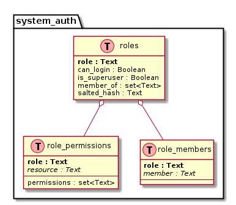

CQL2Plantuml
============


Turn any CQL ( [Cassandra](http://cassandra.apache.org/)) schema into a graphical representation.

A small scala tool to transform a schema to a [plantuml](http://plantuml.com/) puml file that can be in turn transformed into a graphical representation of your CQL schema.


Gallery
=======

## System auth from Cassandra



NB : Because the CQL Schema does not contain any relation between tables, it is up to you to define the relations in the plantuml file.

Downloads
=========

Download a jar file from [release](https://github.com/lbruand/cql2plantuml/releases).

get a CQL schema from C* keyspace _test_ :

```bash
cqlsh -e 'describe keyspace test;' > test.cql
```

run the jar file using :

```bash
java -jar cql2plantuml-1.1-jar-with-dependencies.jar test.cql
```

This creates a *test.puml* file from your input *test.cql* file.
This .puml file does not contain any link.
You can edit it to add links.
You can then run [plantuml](http://plantuml.com/) to obtain a .png or .svg file:

```bash
plantuml -Tpng test.puml
plantuml -Tsvg test.puml
```
Maven plugin
============

You can use cql2plantuml as a maven plugin : 

```xml
    <build>
        <plugins>
            <plugin>
                <groupId>cql2plantuml</groupId>
                <artifactId>cql2plantuml</artifactId>
                <version>1.1</version>
                <executions>
                    <execution>
                        <phase>compile</phase>
                        <goals>
                            <goal>touch</goal>
                        </goals>
                        <configuration>
                            <format>svg</format>
                            <outputPuml>true</outputPuml>
                            <sourceFiles>
                                <directory>src/main/resources</directory>
                                <includes><include>**/*.cql</include>
                                </includes>
                            </sourceFiles>
                        </configuration>
                    </execution>
                </executions>
            </plugin>
        </plugins>
    </build>
```

NB : Because cql2plantuml uses plantuml, you need to install graphviz on the machine.

Derivative work warning
=======================

This work includes classes (CQL AST Parser) originally written by Tamer AbdulRadi distributed under the Apache Licence 2.0 at (https://github.com/schemasafe/troy). These classes were then modified.

This work includes classes originally written by Julien Eluard distributed under the Apache Licence 2.0 at (https://github.com/jeluard/maven-plantuml-plugin). These classes were then modified.


